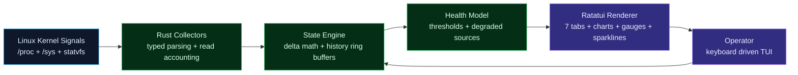

# linwatch

<p align="center">
  
</p>

<p align="center">
  
</p>

<p align="center">
  <a href="https://github.com/njbaulia-wq"></a>
  
  
  
  <a href="https://github.com/njbaulia-wq/linwatch/releases"></a>
  <a href="https://github.com/njbaulia-wq/linwatch/actions/workflows/release.yml"></a>
</p>

<p align="center">
  <a href="#english">English</a>
  ·
  <a href="#indonesia">Indonesia</a>
  ·
  <a href="#quick-start">Quick Start</a>
  ·
  <a href="#usage">Usage</a>
  ·
  <a href="#tabs">Tabs</a>
  ·
  <a href="#cli-reference">CLI</a>
  ·
  <a href="#configuration">Config</a>
  ·
  <a href="#keyboard-shortcuts">Keys</a>
  ·
  <a href="#architecture">Architecture</a>
</p>

---

## English

`linwatch` is a **lightweight Linux TUI monitor** built with Rust, Ratatui, and Crossterm. It reads native Linux metrics directly from `/proc`, `/sys`, and `statvfs`, renders a **7-tab real-time TUI**, explains root causes, tracks recent events, and exports JSON Lines for automation.

### Design Principles

- **No daemon** — runs in your terminal, nothing runs in the background
- **No database** — no SQLite, no time-series DB, no logs
- **No telemetry** — zero network calls, data never leaves your machine
- **Minimal command use** — core metrics use `/proc`, `/sys`, and `statvfs`; optional local helpers enrich Git, systemd, and PCI labels
- **Accountability-first** — every collector reports success or failure per tick

The binary is ~1.5 MB (release) with a configurable TOML config file, keyboard-driven navigation, and panic-safe terminal recovery.

---

## Indonesia

`linwatch` adalah **monitor TUI Linux ringan** yang dibuat dengan Rust, Ratatui, dan Crossterm. Membaca metrik Linux langsung dari `/proc`, `/sys`, dan `statvfs`, menampilkan **TUI 7 tab real-time**, menjelaskan root cause, melacak event terbaru, dan mengekspor JSON Lines untuk automation.

### Prinsip Desain

- **Tanpa daemon** — berjalan di terminal, tidak ada proses latar
- **Tanpa database** — tidak pakai SQLite, time-series DB, atau log
- **Tanpa telemetri** — nol panggilan jaringan, data tidak pernah keluar
- **Command lokal minimal** — metrik inti memakai `/proc`, `/sys`, dan `statvfs`; helper lokal opsional memperkaya Git, systemd, dan label PCI
- **Akuntabilitas** — setiap kolektor melaporkan sukses/gagal per tick

Binary ~1.5 MB (release), konfigurasi via TOML, navigasi keyboard, dan panic-safe terminal recovery.

---

## Quick Start

### Install

```bash
curl -sSfL https://github.com/njbaulia-wq/linwatch/releases/latest/download/install.sh | sh
```

### Run

```bash
linwatch
```

Press `Q` to quit. See [Installation](#installation) for all methods.

---

## Installation

### One-liner (recommended)

```bash
curl -sSfL https://github.com/njbaulia-wq/linwatch/releases/latest/download/install.sh | sh
```

Automatically detects your CPU architecture (x86_64 or aarch64), downloads the matching prebuilt binary, and installs it to `~/.local/bin/`.
The installer verifies the release archive against `sha256sums.txt` before installing.

### GitHub Releases

Download from the [Releases page](https://github.com/njbaulia-wq/linwatch/releases):

```bash
# x86_64
curl -sSfL https://github.com/njbaulia-wq/linwatch/releases/download/v0.1.4/linwatch-v0.1.4-x86_64-unknown-linux-gnu.tar.gz | tar -xz
sudo install linwatch /usr/local/bin/

# aarch64
curl -sSfL https://github.com/njbaulia-wq/linwatch/releases/download/v0.1.4/linwatch-v0.1.4-aarch64-unknown-linux-gnu.tar.gz | tar -xz
sudo install linwatch /usr/local/bin/
```

### Cargo (requires Rust toolchain)

```bash
cargo install linwatch
```

### Build from source

```bash
git clone https://github.com/njbaulia-wq/linwatch.git
cd linwatch
cargo build --release
./target/release/linwatch
```

### Uninstall

To completely remove `linwatch` from your system, delete the binary and configuration files:

```bash
# Remove the binary (check whichever path you installed it to)
rm -f ~/.local/bin/linwatch
sudo rm -f /usr/local/bin/linwatch

# (Optional) Remove the configuration directory
rm -rf ~/.config/linwatch
```

### Instalasi (Indonesia)

**Pilihan 1: Satu baris (recommended)**
```bash
curl -sSfL https://github.com/njbaulia-wq/linwatch/releases/latest/download/install.sh | sh
```
Otomatis download binary yang cocok dengan arsitektur kamu dan pasang ke `~/.local/bin/`.

**Pilihan 2: Cargo (butuh Rust)**
```bash
cargo install linwatch
```

**Pilihan 3: Build dari source**
```bash
git clone https://github.com/njbaulia-wq/linwatch.git
cd linwatch
cargo build --release
./target/release/linwatch
```

**Pilihan 4: Uninstall**

Untuk menghapus `linwatch` sepenuhnya dari sistem Anda, jalankan perintah berikut:

```bash
# Hapus binary (sesuaikan dengan lokasi instalasi Anda)
rm -f ~/.local/bin/linwatch
sudo rm -f /usr/local/bin/linwatch

# (Opsional) Hapus direktori konfigurasi
rm -rf ~/.config/linwatch
```

---

## Usage

### Basic usage

```bash
linwatch                      # Start with default settings
linwatch -i 500ms             # Start with 500ms refresh rate
linwatch --interval=2s        # Start with 2s refresh rate
linwatch --theme high_contrast # Start with high-contrast theme
linwatch --json               # Print system snapshot as JSON, then exit
linwatch --json-pretty        # Print pretty-printed JSON snapshot, then exit
linwatch --json-lines         # Print one compact JSON snapshot line
linwatch --watch-json         # Stream JSON Lines until interrupted
linwatch --watch-json --samples 5  # Stream exactly five samples
linwatch --check-config       # Validate config and exit
linwatch --help               # Show help
linwatch --version            # Show version
```

### Quick keys while running

| Key | Action |
|-----|--------|
| `1`-`7` | Switch to a specific tab |
| `Q` / `Esc` | Exit |
| `R` | Force refresh all metrics now |
| `H` | Toggle help panel overlay |
| `+` / `=` | Increase refresh rate (faster) |
| `-` / `_` | Decrease refresh rate (slower) |

### Process tab controls

| Key | Action |
|-----|--------|
| `S` | Cycle sort order (CPU↓, CPU↑, MEM↓, MEM↑, PID↑, PID↓) |
| `↑` / `↓` | Navigate process list selection |
| `K` | Terminate selected process with SIGTERM (press again to confirm) |
| `/` | Enter search/filter mode |

---

## Tabs

### Tab 1: Overview

The default tab showing a high-level system health dashboard.

| Element | Description |
|---------|-------------|
| **Operator Focus** | Health score, root cause, data quality, thermal, GPU, and network summary |
| **KPI Cards** | Four high-priority cards: CPU, GPU, Memory, and Root Disk |
| **History Charts** | 120-sample line charts for CPU and Memory |
| **Pressure Gauges** | Compact resource pressure meters with severity labels |
| **Guidance Panel** | Root causes, live alerts, storage/GPU context, and recent event timeline |

### Tab 2: CPU

Detailed per-core CPU monitoring.

| Element | Description |
|---------|-------------|
| **CPU Info** | Model name, architecture |
| **Load Average** | 1, 5, and 15-minute load averages |
| **Per-core Bars** | Usage percentage for each logical core, responsive height |
| **Total Usage** | Aggregated CPU usage percentage |
| **Trend Chart** | 120-second history line chart with area fill |

### Tab 3: GPU

Per-GPU monitoring for AMD, Intel, and NVIDIA GPUs.

| Element | Description |
|---------|-------------|
| **GPU Summary** | Vendor, model, driver version for each GPU |
| **Temperature** | Current GPU temperature in °C |
| **Usage** | GPU core utilization percentage |
| **Power Draw** | Current power consumption in watts |
| **Frequency** | Current core clock frequency |
| **VRAM** | Used and total video memory |
| **RC6 Residency** | Intel GPU RC6 sleep state residency |

### Tab 4: Memory

RAM and swap usage overview.

| Element | Description |
|---------|-------------|
| **RAM Gauge** | Visual gauge with used/total and percentage |
| **Swap Gauge** | Visual gauge with used/total and percentage |
| **Detailed Breakdown** | MemTotal, MemAvailable, Buffers, Cached, SwapTotal, SwapFree |
| **Temperature** | Current system temperature |
| **Trend Chart** | 120-second memory usage history |

### Tab 5: Storage

Disk usage and I/O monitoring.

| Element | Description |
|---------|-------------|
| **Root Usage Gauge** | `/` filesystem usage with used/total |
| **Mount Point Table** | List of all mounted filesystems with usage % |
| **Disk I/O Table** | Per-device read/write throughput in KB/s or MB/s (delta-based) |

### Tab 6: Network

Network interface bandwidth monitoring.

| Element | Description |
|---------|-------------|
| **Total Bandwidth** | Aggregated download (RX) and upload (TX) rates across all interfaces |
| **Per-interface Table** | Each interface with RX rate, TX rate, and total |

### Tab 7: Processes

Interactive process management.

| Element | Description |
|---------|-------------|
| **Process Table** | PID, CPU%, MEM%, Command |
| **Sparkline** | Inline 30-tick CPU history chart per process |
| **Sort Modes** | Cycle via `S`: CPU↓, CPU↑, MEM↓, MEM↑, PID↑, PID↓ |
| **High-risk Detection** | Processes exceeding 90% CPU marked with warning |
| **Search** | Press `/` to filter processes by name |
| **Terminate** | Select process with `↑`/`↓`, press `K` twice to send SIGTERM |

---

## CLI Reference

### Options

| Flag | Description |
|------|-------------|
| `-h`, `--help` | Print help information and exit |
| `-V`, `--version` | Print version number and exit |
| `-i <value>`, `--interval <value>` | Set refresh interval. Supported: `500ms`, `750ms`, `1s`, `2s`, `5s` |
| `--interval=<value>` | Alternative syntax for setting interval |
| `--theme <name>` | Set visual theme. Supported: `default`, `high_contrast`, `colorblind` |
| `--theme=<name>` | Alternative syntax for setting theme |
| `--json` | Print single-shot JSON snapshot to stdout and exit |
| `--json-pretty` | Print single-shot pretty-printed JSON snapshot to stdout and exit |
| `--json-lines` | Print one compact JSON snapshot followed by a newline |
| `--watch-json` | Stream JSON Lines at the active refresh interval until interrupted |
| `--samples <n>` | Limit `--watch-json` or `--json-lines` output to `n` samples |
| `--check-config` | Validate configuration and exit |

### Supported refresh intervals

| Interval | Use case |
|----------|----------|
| `500ms` | Fast local inspection, responsive monitoring |
| `750ms` | Balanced default-style monitoring |
| `1s` | General-purpose monitoring |
| `2s` | Lower I/O pressure, longer sessions |
| `5s` | Quiet long-running watch in the background |

### JSON output

The `--json` and `--json-pretty` flags output a complete system snapshot as JSON. Delta-based fields such as CPU, network, disk I/O, and process CPU are sampled twice before output.

```bash
linwatch --json-pretty
```

Example output structure:

```json
{
  "timestamp": "1781939818",
  "hostname": "workstation",
  "kernel": "7.0.12-201.fc44.x86_64",
  "os": "Fedora Linux 44",
  "uptime": "01h 02m",
  "cpu_usage_pct": 23.5,
  "core_count": 8,
  "memory_used_mb": 2847.8,
  "memory_total_mb": 15607.0,
  "memory_used_pct": 18.2,
  "swap_used_mb": 0.0,
  "swap_total_mb": 4096.0,
  "disk_used_pct": 15,
  "disk_used_gb": 34.8,
  "disk_total_gb": 235.9,
  "net_down_bps": 1250000.0,
  "net_up_bps": 450000.0,
  "battery_pct": 80,
  "temperature_c": 61.0,
  "health_score": 92,
  "health_status": "Healthy",
  "process_count": 128,
  "top_cpu_processes": [],
  "top_mem_processes": [],
  "alerts": [],
  "root_causes": [],
  "recent_events": [],
  "sample_status": "OK",
  "environment": "Bare metal",
  "security_mode": "Enforcing"
}
```

JSON Lines mode is intended for automation and AI-assisted diagnostics:

```bash
linwatch --watch-json --samples 10 --interval 1s
```

---

## Configuration

Create a TOML config file at `~/.config/linwatch/config.toml`:

```toml
# --- Refresh interval ---
# Supported: 500ms, 750ms, 1s, 2s, 5s
# CLI --interval overrides this value
refresh_interval = "1s"

# --- Default tab on startup ---
# Options: overview, cpu, gpu, memory, storage, network, processes
default_tab = "overview"

# --- Visual theme ---
# Options: default, high_contrast, colorblind
# high_contrast and colorblind are guarded by automated contrast tests.
theme = "default"

# --- Alert thresholds ---
# When a metric exceeds its threshold, an alert appears in the Overview tab.
# All fields are optional. Defaults are shown below.
cpu_alert     = 85.0    # CPU usage % (float)
mem_alert     = 85.0    # Memory usage % (float)
disk_alert    = 85      # Disk usage % (integer)
temp_alert    = 80.0    # Temperature in °C (float)
battery_alert = 20      # Battery capacity % (integer)
swap_alert    = 35.0    # Swap usage % (float)
```

All fields are optional. Any missing fields use built-in defaults.
Invalid config values are warned about and clamped or ignored safely. Use `linwatch --check-config` in scripts or packaging checks.

---

## Keyboard Shortcuts

### General

| Key | Action |
|-----|--------|
| `Q` / `Esc` | Exit the application |
| `R` | Force refresh all metrics immediately |
| `H` | Toggle help panel overlay |
| `1` | Switch to Overview tab |
| `2` | Switch to CPU tab |
| `3` | Switch to GPU tab |
| `4` | Switch to Memory tab |
| `5` | Switch to Storage tab |
| `6` | Switch to Network tab |
| `7` | Switch to Processes tab |
| `Tab` | Next tab |
| `Shift+Tab` | Previous tab |

### Refresh rate

| Key | Action |
|-----|--------|
| `+` / `=` | Increase refresh rate (cycle to next faster interval) |
| `-` / `_` | Decrease refresh rate (cycle to next slower interval) |

### Process tab

| Key | Action |
|-----|--------|
| `S` | Cycle sort order: CPU↓ → CPU↑ → MEM↓ → MEM↑ → PID↑ → PID↓ |
| `↑` | Move selection up in process list |
| `↓` | Move selection down in process list |
| `K` | Terminate selected process (first press marks, second confirms with SIGTERM) |
| `/` | Enter search mode; type to filter processes by name; `Esc` to exit |

---

## Architecture

### Project structure

```
src/
├── main.rs         # Entry point, CLI parsing, config loading, panic guard
├── types.rs        # Data structures, AppState, health model, alerts, config types
├── collector.rs    # Raw metric readers (/proc/stat, /proc/meminfo, /proc/diskstats, etc.)
├── state.rs        # State engine: update, delta math, history ring buffers, health, alerts
└── ui/
    ├── mod.rs      # TUI module root, event loop, keyboard handler, tab dispatch
    ├── theme.rs    # Default, high-contrast, and colorblind-safe themes
    ├── common.rs   # Shared UI utilities (panel blocks, formatting, layout helpers)
    ├── header.rs   # Top bar: hostname, OS, kernel, health score, battery, load avg
    ├── footer.rs   # Bottom bar: keyboard shortcuts, refresh rate, network rates
    ├── help.rs     # Help modal overlay
    ├── overview.rs # Overview tab: 5 KPI cards, history charts, alerts
    ├── cpu.rs      # CPU tab: per-core bars, load avg, trend chart
    ├── gpu.rs      # GPU tab: vendor/model, temp, usage, power, freq, VRAM
    ├── memory.rs   # Memory tab: RAM + swap gauges, breakdown, trend
    ├── storage.rs  # Storage tab: root gauge, mount table, disk I/O
    ├── network.rs  # Network tab: total rates, per-interface table
    └── processes.rs # Processes tab: sortable table, sparkline, search, terminate
```

### Data flow



### Per-tick data flow

1. **Collect** — all collectors run in sequence; each returns `Option<T>` (success) or `None` (failure)
2. **Account** — `capture()` increments `successful_reads` or `failed_reads` + `degraded_sources`
3. **Compute** — CPU/network/disk-I/O deltas, process CPU normalization, trend history push
4. **Evaluate** — health score calculation, threshold alerts, process high-risk markers, sparkline update
5. **Render** — terminal draws the current tab: charts, gauges, tables, alerts

Lazy reads: battery every 5 ticks, thermal every 3 ticks, GPU every 4 ticks, systemd/ports/storage-health every 8 ticks, git every 24 ticks (backing off 5x after repeated failures outside a repo). System info and environment detection run once at startup. Absent optional sources (no systemd, no battery, no sensors) are skipped, never counted as sample failures.

---

## Signal Sources

| Layer | Signal | Source | Granularity |
|-------|--------|--------|-------------|
| Compute | CPU total, per-core, load 1/5/15m | `/proc/stat`, `/proc/loadavg` | Per-tick delta |
| Memory | RAM used/total, swap used/total | `/proc/meminfo` (`MemAvailable`, emulated from free+buffers+cache on kernels < 3.14) | Instant read |
| Storage | Mount usage, mount list | `/proc/mounts` (pseudo-filesystems excluded) + `statvfs` | Instant read |
| Disk I/O | Per-device read/write throughput | `/proc/diskstats` | Delta-based |
| Network | Per-interface RX/TX bytes | `/proc/net/dev` | Delta-based |
| Open ports | Listening TCP/UDP ports, IPv4 + IPv6 | `/proc/net/tcp`, `/proc/net/udp`, `/proc/net/tcp6`, `/proc/net/udp6` | Every 8 ticks |
| GPU | Vendor, model, temp, usage, power, freq, VRAM, RC6 | `/sys/class/drm` + `/sys/class/hwmon`, optional local PCI label cache | Every 4 ticks |
| Processes | Top CPU/MEM, count, per-process sparkline | `/proc/<pid>/stat` | Delta CPU, instant MEM |
| Battery | Capacity %, charging status | `/sys/class/power_supply` | Every 5 ticks |
| Thermal | Temperature in °C | `/sys/class/thermal` (CPU zones preferred, battery zones skipped) | Every 3 ticks |
| Platform | OS, kernel, hostname, CPU model, environment | `/etc/os-release` (fallback `/usr/lib/os-release`, `/run/host/os-release`), `/proc/sys/kernel/*`, `/proc/cpuinfo` (x86 + ARM layouts) | Once at startup |
| Local status | Failed units (best-effort), Git dirty count | `systemctl` (skipped when systemd absent), `git status --porcelain` | systemd+ports every 8 ticks, git every 24 ticks with backoff |

---

## Sample Accountability System

Every tick, each metric collector reports its status. The application tracks and displays the overall sample quality:

| Status | Meaning |
|--------|---------|
| `OK` | All tracked sample sources were read successfully |
| `Partial` | One or two tracked sources failed in the latest sample |
| `Degraded` | More than two tracked sources failed in the latest sample |

The sample status is displayed in the header bar next to the health score.

CPU and process percentages are delta-based — the first sample shows zero values until the second sample is collected. Process CPU percentage is normalized against total CPU jiffies across all cores.

### Health Score

The health score (0-100) is calculated using a penalty-based system:
- Starts at 100
- Each exceeded threshold (CPU, memory, disk, swap, temperature) applies a penalty
- More severe violations result in larger penalties
- The score is displayed in the header bar

---

## Accuracy Notes

- **CPU**: reads `/proc/stat` fields 3 (idle) + 4 (iowait) as idle. Delta over refresh interval.
- **Memory**: uses `MemAvailable` for used calculation (`MemTotal - MemAvailable`), not `MemFree`. On kernels older than 3.14 (no `MemAvailable`), availability is emulated as `MemFree + Buffers + Cached + SReclaimable`, like `free(1)`.
- **CPU model**: `model name` on x86; `Model` / `Hardware` (+`Revision`) / `CPU part` on ARM (e.g. Raspberry Pi).
- **Process CPU**: `utime + stime` from `/proc/<pid>/stat`, normalized against total CPU delta. The first tick always shows 0% since no delta exists yet.
- **Disk I/O**: sector count * 512 bytes. Delta over refresh interval. Filters out loop, dm-*, ram, and zram devices.
- **Network**: byte counters from `/proc/net/dev`. Skips loopback interface. Delta over refresh interval.
- **Open ports**: parses `/proc/net/tcp|udp|tcp6|udp6`. IPv6 addresses are 32-hex words with per-word byte order corrected. TCP shows `LISTEN` only; UDP shows `OPEN`.
- **GPU**: reads from `/sys/class/drm` for device information and `/sys/class/hwmon` for temperature/power metrics. Intel RC6 residency from `power/rc6_residency_ms` in sysfs.
- **Battery/Thermal**: read every 5/3 ticks respectively to reduce I/O pressure on `/sys`. Battery/charger thermal zones are never used as system temperature.
- **Mounts**: all real filesystems are shown (pseudo-filesystems such as `proc`, `sysfs`, `tmpfs`, `cgroup*`, `overlay`, `squashfs` excluded); the root disk gauge prefers `/`.

---

## Development

### Prerequisites

- Rust toolchain (install via [rustup](https://rustup.rs/))
- Linux system with `/proc` and `/sys` (works across common Linux distributions)

### Commands

```bash
cargo fmt                  # Format code
cargo test                 # Run unit tests (50+ tests)
cargo clippy -- -D warnings # Lint
cargo build --release      # Build optimized binary
```

### Adding a new metric

1. Define the data struct in `src/types.rs`
2. Implement the reader function in `src/collector.rs`
3. Add update logic in `src/state.rs` (`AppState::update`)
4. Render the data in the appropriate `src/ui/<tab>.rs` file (or add a new tab in `src/ui/mod.rs`)

### Release process

```bash
cargo fmt --check
cargo test --locked
cargo clippy --all-targets --locked -- -D warnings
cargo build --release --locked

git tag v0.2.0
git push origin v0.2.0
```

GitHub Actions automatically:

- runs CI on pushes and pull requests
- builds release binaries for `x86_64-unknown-linux-gnu` and `aarch64-unknown-linux-gnu`
- packages `linwatch`, `README.md`, `LICENSE`, and `install.sh`
- publishes `.tar.gz` archives
- generates and uploads `sha256sums.txt`

The install script downloads both the archive and checksum file, verifies SHA256, then installs the binary.

---

## Binary specs

```
Size:       ~1.5 MB (stripped release build)
Strip:      symbols stripped in release profile
LTO:        thin
opt-level:  3
codegen-units: 1
Targets:    x86_64-unknown-linux-gnu, aarch64-unknown-linux-gnu
Dependencies: libc (via statvfs/sysconf), no external runtime
```

---

## License

MIT
